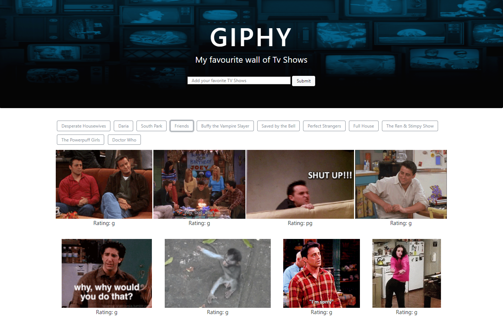

# GifTastic

https://sheimagh.github.io/GifTastic/

This app uses GIPHY API making dynamic web page that populates with gifs of my choice. To finish this task, I call the GIPHY API and use JavaScript and jQuery to change the HTML of my site. 

